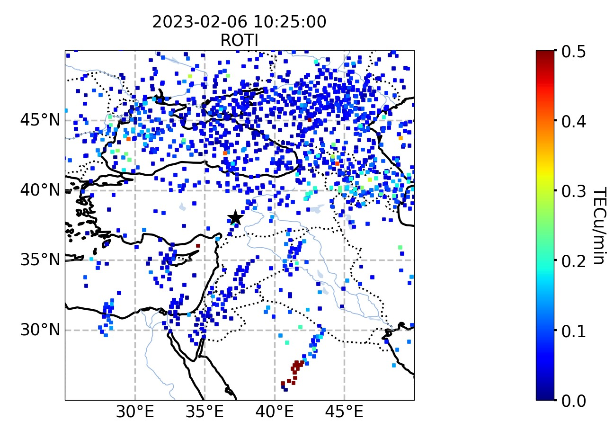

# Графики по землетрясениям

## Описание
Данный код на Python позволяет визуализировать графики по землетрясениям на карте. Он использует библиотеки **matplotlib**, **cartopy** и **h5py** для работы с данными и отображения картографической информации.

## Описание некоторых функций
### prepare_layout
Функция **prepare_layout** используется для подготовки макета (layout) графика, который будет отображаться на карте. Она выполняет следующие задачи:

1. Устанавливает параметры рисунка (figure) и осей (axes) для графика.
2. Устанавливает ограничения по широте и долготе для карты, определяя границы отображаемой области.
3. Добавляет дополнительные элементы на карту, такие как береговая линия, границы, озера и реки.
4. Создает и настраивает сетку (gridlines) для осей с заданным стилем и метками широты и долготы.

В итоге, функция **prepare_layout** помогает настроить внешний вид и структуру графика на карте, обеспечивая правильное отображение данных и добавляя необходимые географические элементы для контекста.

### retrieve_data
Функция **retrieve_data** принимает на вход имя файла (file), тип данных (type_d) и список временных меток (times). Функция извлекает данные из указанного файла для заданного типа данных и временных меток. Вы можете дальше обрабатывать полученные данные или передать их в функцию plot_map для построения графиков.

### retrieve_data_multiple_source
Функция **retrieve_data_multiple_source** извлекает данные из нескольких файлов или источников и объединяет их в одну структуру данных для последующего анализа или визуализации. Она упрощает процесс объединения данных из разных источников, обеспечивая единообразное представление данных и удобный доступ к ним.

### plot_map
**plot_map** является одной из основных функций данной библиотеки. Она позволяет визуализировать данные землетрясений на карте, обеспечивая наглядное представление распределения землетрясений в пространстве и времени. На вход подаются следующие значения:

- plot_times: список временных меток для построения графиков
- data: словарь с данными по землетрясениям, где ключ - тип данных, значение - массив данных
- type_d: тип данных, который будет отображаться на графике
- lon_limits: диапазон долгот (по умолчанию от -180 до 180)
- lat_limits: диапазон широт (по умолчанию от -90 до 90)
- nrows: количество строк графиков (по умолчанию 1)
- ncols: количество столбцов графиков (по умолчанию 3)
- markers: список маркеров для отображения на карте
- sort: сортировка данных (по умолчанию False)
- use_alpha: использование альфа-канала для прозрачности (по умолчанию False)
- clims: диапазон цветовой шкалы (по умолчанию C_LIMITS)
- savefig: имя файла для сохранения графика (по умолчанию пусто)

### plot_maps
Функция **plot_maps** используется для создания графиков на карте, отображающих данные из разных источников или файлов. Она выполняет следующие задачи:

1. Принимает входные параметры, такие как список файлов с данными (prod_files), типы данных (prods), эпицентры землетрясений (epc), границы цветовых шкал (clims), временные метки (times) и предел цветовой шкалы (scale).
2. Определяет границы цветовых шкал в зависимости от указанных или использует значения по умолчанию.
3. Проверяет и форматирует временные метки, если они указаны, иначе использует значения по умолчанию.
4. Итерируется по файлам данных и их соответствующим типам данных.
5. Использует функцию **retrieve_data_multiple_source** для извлечения данных из каждого файла.
6. Создает графики на карте с помощью функции **plot_map**, передавая временные метки, данные, типы данных и другие параметры.
7. Выводит графики на экран или сохраняет их в файлы в зависимости от указанных параметров.

Функция **plot_maps** позволяет визуализировать данные на карте с различными типами данных и из разных источников. Она упрощает создание графиков, объединяя данные из разных файлов и предоставляя удобный способ отображения информации о землетрясениях и других явлениях на географической карте.

## Примеры использования
Отобразим график на конкретное время для файла roti_10_24.h5 с помощью **plot_map**.

```python
#Заносим данные об эпицентре землетрясения в словарь, где ключ - время,
#значение - вложенные словарь с широтой, долготой и дата+время
EPICENTERS = {'10:24': {'lat': 38.016,
                        'lon': 37.206,
                        'time': datetime(2023, 2, 6, 10, 24, 50)}
             }

#Определим время
times = [datetime(2023, 2, 6, 10, 25)] 
times = [t.replace(tzinfo=t.tzinfo or _UTC) for t in times]

#Получим данные из roti_10_24.h5 по заданному времени и типу файла ROTI 
data = retrieve_data("./roti_10_24.h5", "ROTI", times)

#Занесем в словарь, где ключ - тип файлам, значение - полученные данные
data = {"ROTI": data}

#Определим диапазон цветовой шкалы в словаре, где ключ - типу файла, значение - массив
C_LIMITS = {
            'ROTI': [0, 0.5,'TECu/min']
        }

#Используем plot_map. Если необходимо сохранить график, то в savefig прописываем имя изображения
plot_map(times, data, "ROTI",
             lat_limits=(25, 50),
             lon_limits=(25, 50),
             ncols=1,
             sort=True,
             markers=[EPICENTERS['10:24']],
             clims=C_LIMITS,
             savefig=''
            )
```


Теперь отобразим несколько графиков для трех файлов с помощью **plot_maps**.

```python
#Данные об эпицентре землетрясения остаются теми же, что и в прошлом примере

#В FILES_PRODUCT_10_24 занесем путь к файлам и их типы
FILES_PRODUCT_10_24 = {"./dtec_2_10_10_24.h5": "2-10 minute TEC variations",
                       "./dtec_10_20_10_24.h5": "10-20 minute TEC variations",
                       "./dtec_20_60_10_24.h5": "20-60 minute TEC variations"
                       }

#Определим время (на этот раз берём два разных времени)
times = [datetime(2023, 2, 6, 10, 25),
            datetime(2023, 2, 6, 10, 40)]

#Определим диапазон цветовой шкалы
C_LIMITS ={'2-10 minute TEC variations': [-0.4, 0.4, 'TECu'],
            '10-20 minute TEC variations': [-0.6, 0.6, 'TECu'],
            '20-60 minute TEC variations': [-1, 1, 'TECu']
}
        

plot_maps([FILES_PRODUCT_10_24],
          FILES_PRODUCT_10_24,
          EPICENTERS['10:24'],          
          clims=C_LIMITS,
          times=times,
          lat_limits=(25, 50),
          lon_limits=(25, 50),
          nrows=1,
          ncols=2)
```


## Инструкция по установке
Для начала необходимо активировать своё виртуальное окружение, клонировать репозиторий с данной библиотекой и перейти в папку с проектом.
> git clone https://github.com/EkaterinaKugot/Turkey_EQ_notebook.git
> 
> cd */Turkey_EQ_notebook

Для упрощения сборки написан Makefile, поэтому будем использоват его. Перед сборкой необходимо проверить, что тесты проходят.
> make test

Если тесты прошли успешно, то собираем наш проект.
> make build 

У нас появилось несколько новых каталогов. И наш собранный пакет расположен в dist. Проверим, что **turkey_eq** не установлен в нашем окружении, команда ниже ничего не должна вывести.
> pip list | grep turkey_eq

И устанавливаем собранный пакет turkey_eq-1.0-py3-none-any.whl.
> pip install ./dist/turkey_eq-1.0-py3-none-any.whl

Проверяем наличие **turkey_eq**. Команда должны вывести название библиотеки и версию.
> pip list | grep turkey_eq


